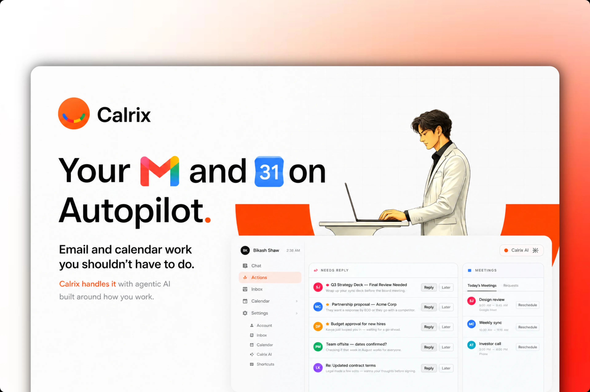

<h1>Calrix</h1>

<strong>Your inbox and calendar, on autopilot.</strong>

Calrix is an AI platform that reads, sorts, and ranks your gmail, drafts replies that sound like you, guards your google calendar, and chases down the replies you're still waiting on — so you only ever touch what actually needs you with minimum number of clicks.

---

## What Calrix does for you?

Calrix works quietly in the background and surfaces only what matters. Here's everything it handles.

### Inbox Zero, on autopilot

- **Smart triage** — Calrix reads every primary email and sorts it into clear buckets: _reply needed_, _approval_, _meeting_, or _just FYI_. Promotions, social, and noise are filtered out automatically.
- **Priority ranking** — Each email is tagged by urgency (critical, high, or normal) so the things that can't wait rise straight to the top.
- **One-line summaries** — Instead of opening a long thread, you get the gist: _"David needs the signed contract by Friday."_
- **Live alerts for the urgent stuff** — The moment a truly time-sensitive email lands, your dashboard lights up in real time.

### Drafts that sound like you

- **Replies in your voice** — Calrix studies your past emails and writes drafts that match your persona — ready to send, not generic filler.
- **Approve in a click** — Routine replies can be pre-drafted and waiting. Review, tweak, send.
- **Smart confidence levels** — Every suggested action is graded: _safe to auto-handle_, _worth a quick review_, or _needs your approval_ — so Calrix never oversteps on anything sensitive.

### A calendar that defends itself

- **Natural-language scheduling** — Just say _"set up a 30-min call with Jane next Tuesday afternoon"_ and Calrix finds the slot, checks for conflicts, and books it.
- **Conflict-aware** — Before booking, Calrix checks your availability and suggests open slots when your first choice is taken.
- **Reschedule & cancel with a sentence** — Move or clear events conversationally; Calrix confirms the new time is actually free before touching anything.
- **Invites handled end-to-end** — It creates the event _and_ drafts the invitation email to attendees.

### Never drop the ball on follow-ups

- **Tracks what you're waiting on** — Every email you send that expects a reply is quietly watched.
- **Surfaces stalled threads** — See exactly who hasn't gotten back to you, ranked by what matters most right now.
- **Knows when something's overdue** — Threads past their deadline or gone quiet for days get flagged so you can nudge at the right moment.

### Chat with your inbox

- **Talk to Calrix in plain English** — Ask _"what did Acme say about the renewal?"_ or _"reply to Jane and tell her I'm in."_ It reads, searches, drafts, sends, schedules — all from one chat box.
- **Interactive widgets** — Instead of typing everything, Calrix hands you clean controls: an event form to confirm a meeting, a draft preview to edit-and-send an email, quick pick-lists for time slots and attendees.
- **Contact memory** — Mention someone by name and Calrix remembers their email for next time — no more digging for addresses.
- **Stays in its lane** — Calrix is a focused Gmail + Calendar specialist and won't wander off-topic or take a risky action without your okay.

### Built around how _you_ work

A quick onboarding tailors Calrix to you:

- **Your role** — founder, sales, engineering, ops, or your own description.
- **Your volume** — how busy your inbox really is.
- **What "urgent" means to you** — VIP senders, deadlines, money/contracts, replies, scheduling, or assigned tasks.
- **Summary style** — a one-line gist or the full picture.
- **Follow-up intensity** — from a gentle nudge only when overdue, to staying on top of everything.
- **VIP senders** — people who should always land at the top.
- **Privacy first** — opt out of anything model-improvement related at any time.

### Private and secure by design

- Your emails and contacts are **never shared**. Connections are encrypted.
- Secure sign-in with your Google account.
- Granular, per-user data isolation across everything Calrix touches.

---

## 💎 Plans

|                | **Pilot**                                           | **Team**                                                      | **Scale**                                              |
| -------------- | --------------------------------------------------- | ------------------------------------------------------------- | ------------------------------------------------------ |
| **For**        | Proving value on one inbox                          | Putting your team on autopilot                                | Orgs that live in the inbox                            |
| **Price**      | From $99/mo                                         | $199/mo                                                       | Custom                                                 |
| **Seats**      | 1 inbox + calendar                                  | Up to 7                                                       | Unlimited                                              |
| **AI actions** | 500 / month                                         | 5,000 / month                                                 | Custom                                                 |
| **Highlights** | Smart triage, on-brand drafts, automated follow-ups | Shared scheduling, meeting prep & summaries, priority support | SSO, advanced security, dedicated success manager, SLA |

---

For stack details, architecture, and local setup see [TECHNICALS.md](TECHNICALS.md).

---

Built to give you back the hours your inbox quietly steals.  Calrix

